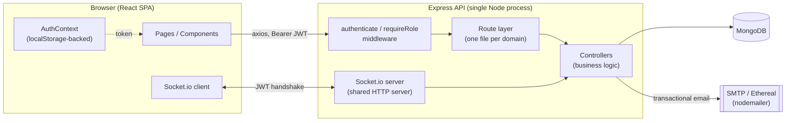
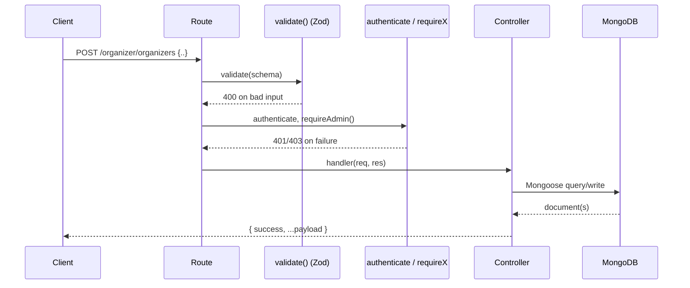

# Architecture

Convene is a two-app system: a React single-page app (SPA) talking to a stateless
Express REST API, backed by MongoDB, with a Socket.io channel layered on the same
HTTP server for realtime features (team chat, live notifications).

## System overview

There is no server-side rendering and no separate API gateway — `frontend/`
(Vite + React Router) and `backend/` (Express) are independently deployed
(frontend on Vercel, backend on Render in the reference deployment; see
`docs/DEPLOYMENT.md`) and communicate purely over HTTP + WebSocket.

## Actor model

The system has three kinds of authenticated actor, encoded directly in the JWT
payload rather than as a single "user" table with a role column spanning
everything:

| Actor | Collection | `actorType` | `role` |
|---|---|---|---|
| Participant | `User` | `user` | `participant` |
| Admin | `User` | `user` | `admin` |
| Organizer | `Organizer` (separate collection) | `organizer` | *(none — implicit)* |

A JWT payload is always `{ id, actorType, role? }`. Organizers deliberately have
no `role` field — `authHelpers.isValidPayload` rejects a payload that has one,
so an organizer token can never be coerced into passing an admin check.
`middleware/authContracts.js` builds every permission check from two
primitives:

- `requireActor(actorType)` — is this a `user` or an `organizer`?
- `requireRole(role)` — for `user` actors, are they `participant` or `admin`?

`requireAdmin()`, `requireOrganizer()`, and `requireParticipant()` are just
named compositions of those two primitives. There is intentionally **no admin
registration endpoint** — the only admin account is created at boot time from
`ADMIN_EMAIL`/`ADMIN_PASSWORD` env vars (`utils/bootstrap.js`), so there's no
API surface an attacker could hit to mint a new admin.

## Request lifecycle (typical write)

Validation (`middleware/validate.js` + Zod schemas in `src/validation/`) is
applied at the route layer, before auth and before the controller ever sees
the request body — currently wired for the auth and organizer-creation
endpoints (see `docs/BACKEND.md` for what's validated vs. not yet).

## Realtime layer

A single Socket.io server (`src/sockets/teamChat.js`) is attached to the same
HTTP server Express listens on. Every authenticated socket connection
auto-joins a personal room (`notify-actor-<actorType>-<id>`), which is how
`utils/notify.js` pushes live in-app notifications. Participants additionally
join `team-<teamId>` rooms for team chat, with in-memory presence tracking
(who's online) and a lightweight `notify-team-<teamId>` room for message
badges without opening the chat pane.

## Key design decisions

- **No service layer.** Controllers call Mongoose models directly. At this
  scale (a handful of collections, no cross-cutting transactions) a service
  layer would be indirection without payoff; if the domain grows past a couple
  more actor types or workflows, that's the point to introduce one.
- **Validation is opt-in per route, not global.** Zod schemas exist for the
  highest-risk inputs (auth, organizer creation); the remaining controllers
  still do inline `if (!field) return 400` checks. See `docs/BACKEND.md` for
  the specific gap.
- **Institution branding is configurable, not hardcoded.** The "affiliated vs.
  general" participant distinction (`INSTITUTION_NAME` /
  `INSTITUTION_EMAIL_DOMAINS` env vars) exists so a fork can point this at any
  college/company without touching code — see `backend/.env.example`.
