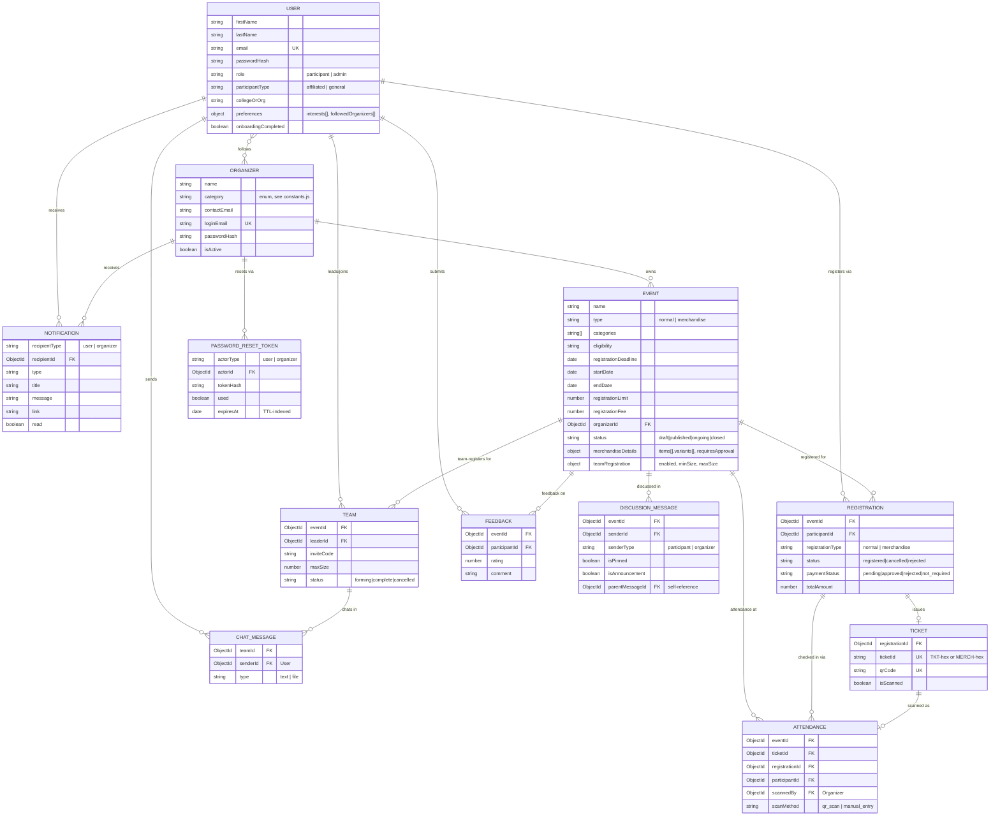

# Database

MongoDB via Mongoose. 12 collections, no shared base schema/plugin — each
model is a plain `mongoose.Schema`. No transactions are used anywhere
(cascade deletes are orchestrated in application code — see the note on
`deleteOrganizer` below).

## Entity relationship diagram

## Notes on specific models

- **`User` vs `Organizer` are separate collections**, not a discriminated
  union — organizers have their own `passwordHash`/`loginEmail` and no
  `role`. This mirrors the actor model in `docs/ARCHITECTURE.md`.
- **`Registration` has two status fields** — a generic `status`
  (registered/cancelled/rejected) and a separate `paymentStatus` used only by
  the merchandise path. This is a known minor schema smell (two parallel
  status fields on one model) rather than a deliberate design choice; splitting
  merchandise registrations into their own model would be the natural fix if
  the merchandise feature grows further.
- **`Event.merchandiseDetails.requiresApproval`** now does what its name
  says: `false` skips the pending-payment step and issues a ticket
  immediately (see `merchandiseController.purchaseMerchandise`); `true`
  (the default) routes through organizer approval as before.
- **Ticket IDs** are consistently `TKT-<16-hex>` for normal-event tickets and
  `MERCH-<16-hex>` for merchandise tickets, generated from `crypto.randomBytes`
  — both paths go through the same `generateTicketId(prefix)` helper in
  `merchandiseController.js` (the equivalent logic in `teamController.js`/
  `participantEventController.js` for normal tickets predates that helper but
  uses the identical format).
- **Cascade delete** (`adminController.deleteOrganizer`) removes an
  organizer's events and everything depending on them (registrations,
  tickets, attendance, feedback, discussion messages, teams,
  password-reset tokens) in application-code order, not a Mongo transaction.
  A crash mid-cascade could leave orphaned records — acceptable at this scale,
  worth revisiting with Mongo transactions if this becomes a
  frequently-invoked admin action in production.
- **Indexes worth knowing about**: `Registration` has a unique compound index
  on `{eventId, participantId}` (no double-registering), `Feedback` the same
  shape, `Attendance` a unique index on `ticketId` (no double-scanning), and
  `PasswordResetToken.expiresAt` is a TTL index — MongoDB deletes expired
  tokens automatically, no cleanup job needed.
